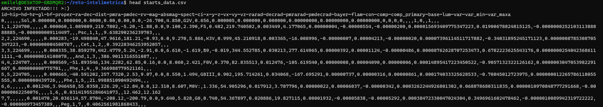
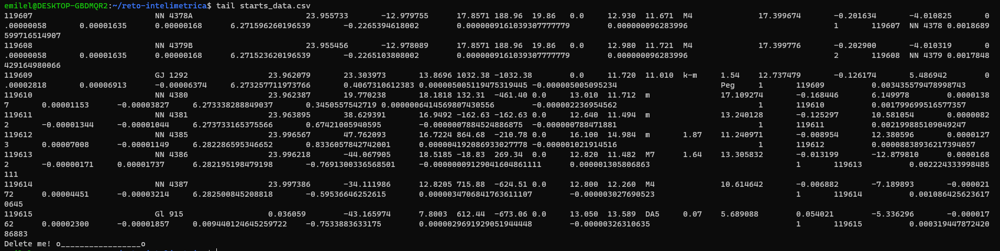
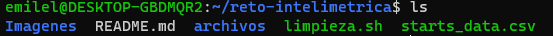
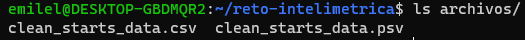

# Reto PSV

## Nombre: :alien:

:space_invader: José Emiliano Herrera Velázquez

	 
	
	 

Esta es mi solución al reto de Intelimétrica

## Instrucciones :open_mouth:

### Misión  IM-DE-1

Bienvenido soldado, se te ha asignado la misión IM-DE-1 en el cuartel espacial Intelimétrica.

Un pirata-espacial burló nuestros sistemas de seguridad logrando infiltrarse en nuestros sistemas y ha dañado un archivo de vital importancia, ya que contiene la información recopilada a lo largo de los últimos 100 años de las estrellas de nuestro universo. Nuestros científicos necesitan esta información para poder encontrar nuevas fuentes de energía, ya que nuestro sol está muriendo.

Soldado, tu misión es escribir un script que lea el archivo infectado (starts_data.csv) y lo transforme en un archivo PSV (Pipe Separated Values) formateado correctamente para que nuestros científicos puedan leerlo en cualquier CSV/PSV parser.

Tu deber es que:

- Cada valor deberá estar separada por el carácter ‘|’ (Pipe). Ej: (v_1|v_2|v_3)

- Cada linea deberá tener el mismo numero de columnas.

- Cada valor deberá tener el quotechar ‘”’(Doble comillas). Ej. Ej: (“v_1”|”v_2”|”v_3”)

- El archivo deberá estar almacenado con un enconding de UTF-8

Soldado, contamos con tus habilidades para salvar los datos, cada segundo cuenta…  

Al finalizar tu misión deberás enviarnos el script y el archivo PSV que obtuviste.

Te deseamos todo el éxito para lograr completar esta misión.

https://recruiting-datasets.s3.us-east-2.amazonaws.com/starts_data.csv

## Solución :sunglasses:

### Análisis exploratorio
:point_right: Después de descargar el archivo [starts_data.csv](https://recruiting-datasets.s3.us-east-2.amazonaws.com/starts_data.csv) apliqué los comandos `head starts_data.csv` y `tail starts_data.csv` que muestran los primeros y últimos 5 registros del archivo en cuestión.

:point_right: Se observa que la primera línea del archivo es un caracter que no sirve, así como la última. Además, los nombres de los campos están separadas por "~", los primeros registros están separados por comas y los últimos por tabuladores. 

:point_right: Una vez realizada la limpieza de los puntos anteriormente mencionados obtenemos un "dataframe" de dimensión 119615 registros y 37 campos.

### Programa de limpieza (recuperación) del archivo.
##### Importante, antes de correr el archivo hay que dar permisos de ejecución, lectura y escritura al script así que ejecutar:

`chmod 777 limpieza.sh`

:point_right: Este programa fué escrito en bash. Hace uso de los comandos `awk` y `sed`. Y se usa de la siguiente manera en la terminal:

`./limpieza.sh archivo_a_recuperar`

En este caso sería:

`./limpieza.sh starts_data.csv`

:point_right: Esto arroja un directorio llamado "archivos" donde se alojan los .csv y .psv con los datos límpios.

:point_right: Por último, con el comando `file -bi` observamos que los archivos con los datos limpios están en formato "us-ascii" lo que significa que están codificados en "utf-8" ya que estos primeros son como un "subconjunto de utf-8" [Force encode from US-ASCII to UTF-8 (iconv)
](https://stackoverflow.com/questions/11303405/force-encode-from-us-ascii-to-utf-8-iconv).

